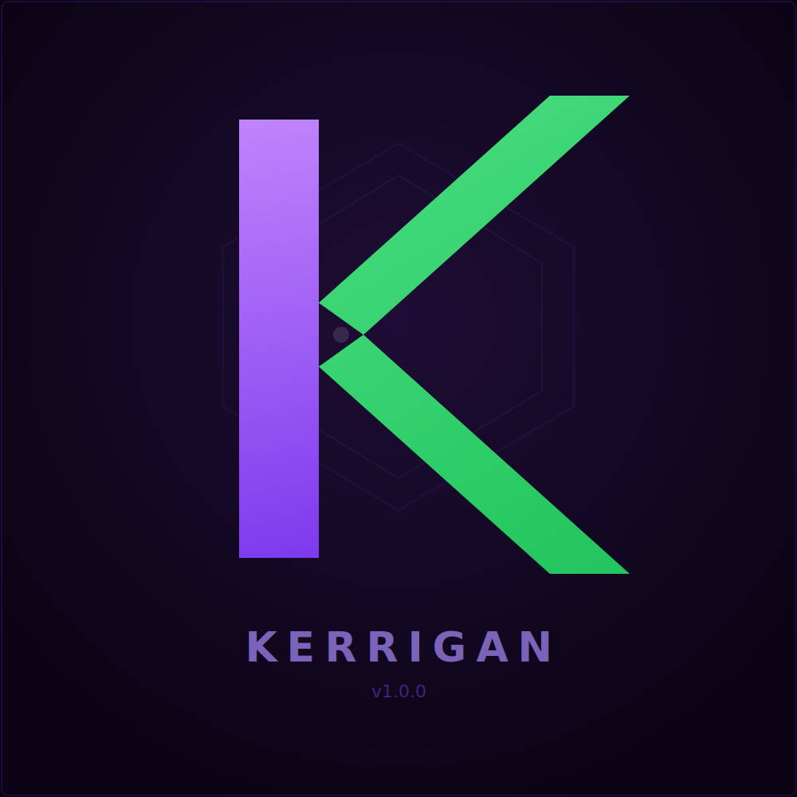
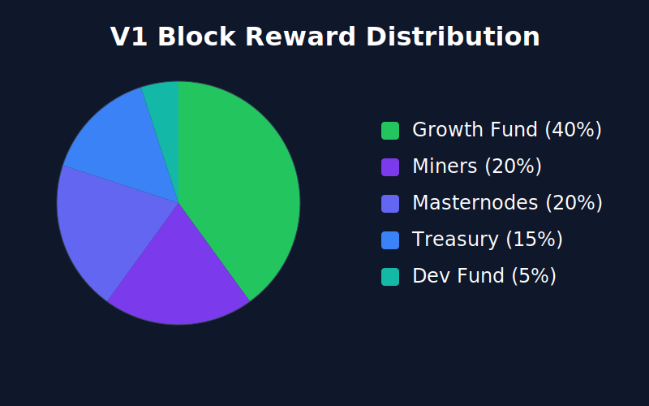

# Kerrigan (KRGN)
[Website](https://kerrigan.network/) | [Explorer](https://explorer.kerrigan.network/) | [Whitepaper](https://kerrigan.network/whitepaper.html) 
[Pool](https://pool.kerrigan.network) | [Discord](https://discord.gg/V9P3UDjkFu) | [𝕏](https://x.com/kerrigannetwork)

**Mine it. Stake it. Build with it.**

A multi-algorithm cryptocurrency built for miners.

---

## Fair Launch

- No pre-mine, no ICO, no VC allocation
- Every coin earned through work -- mining or masternodes
- Open source from block zero

## Multi-Algorithm Mining

- Four PoW algorithms: X11, KawPoW, Equihash-200,9, Equihash-192,7
- Mine with ASICs, GPUs, or both -- no single hardware monopoly
- Hivemind per-algorithm difficulty adjustment -- no algo gaming
- 20% block reward to miners -- the network exists because you do

Each algorithm has independent difficulty adjustment. Standard `getblocktemplate` and `submitblock` RPC, no custom stratum changes needed.

The daemon supports per-algo RPC ports so each algorithm gets its own listener. Pool software connects to the right port and `getblocktemplate` returns templates for that algo with no extra params:

```ini
# kerrigan.conf
rpcalgoport=kawpow:7300
rpcalgoport=equihash200:7200
rpcalgoport=equihash192:7192
# X11 uses default RPC port 7121
```

Pool on port 7300 calls `getblocktemplate`, gets a KawPoW template. Port 7192 gets Equihash 192,7. Loopback only, same auth as default RPC. See [doc/pool-integration.md](doc/pool-integration.md) for pool setup details.

## Masternode Network

- InstantSend -- transactions confirmed in seconds
- ChainLocks -- 51% attack prevention, finality in one block
- Decentralized governance -- masternodes vote on proposals
- 10,000 KRGN collateral

## Hivemind Meritocratic Protocol (HMP)

Sealing is the process that binds miner identity to the chain. After mining a block, your daemon broadcasts a BLS signature share. When enough shares are collected, an assembled seal is embedded in the next block's coinbase. This creates a verifiable record of who is actively contributing hashrate, which feeds into privilege tiers and VRF-based committee selection.

### RPC Commands

| Command | Description |
|---|---|
| `gethmpinfo` | HMP status, identity, privilege tiers per algo, commitment state |
| `gethmpprivilegedset` | Per-algo miner rankings: tier, blocks solved, seal participations, dominance |
| `getsealstatus <blockhash>` | Seal details for a block: signers, share count, assembled hash, proof presence |
| `gethmpdiagnostics` | Debug: recent sign attempts with pass/fail reasons, active sessions, commitment pool |

### P2P Messages

| Message | Direction | Purpose |
|---|---|---|
| `SEALSHARE` | broadcast | BLS signature share from an eligible miner after a new block |
| `SEALASM` | broadcast | Assembled seal (aggregated shares), includes height for catch-up |
| `PUBKEYCOMMIT` | broadcast | Pubkey commitment (roll call), must arrive K blocks before sealing eligibility |

### Typical Flow

1. Miner mines a block, daemon broadcasts `PUBKEYCOMMIT` automatically
2. K blocks later (commitment offset=10), miner becomes eligible to seal
3. New block arrives, `SignBlock()` checks VRF selection, broadcasts `SEALSHARE`
4. `CSealManager` collects shares, `TryAssemble()` fires when threshold is met, broadcasts `SEALASM`
5. Next miner embeds the assembled seal in CCbTx v4

### Quick Checks

```sh
kerrigan-cli gethmpinfo                   # am I sealing?
kerrigan-cli gethmpprivilegedset          # what tier am I per algo?
kerrigan-cli gethmpdiagnostics            # why did my last sign attempt fail?
kerrigan-cli getsealstatus <blockhash>    # who signed this block's seal?
```

## zk-SNARK Privacy

- Zcash Sapling shielded transactions (activates at block 500)
- Sender, receiver, and amount hidden -- cryptographic proof, not mixing
- Optional transparency -- use shielded or transparent as needed

## Block Reward (V1)


| Recipient | Share | Purpose |
|-----------|-------|---------|
| Growth Escrow | 40% | Consensus-locked until governance vote (burns after block 262,800) |
| Miners | 20% | Hashrate security across 4 algorithms |
| Masternodes | 20% | Network infrastructure and governance |
| Development | 15% | Core protocol development |
| Founders | 5% | Project originator |

## Roadmap

**V1 (Launch):** Multi-algo PoW mining, masternodes, Sapling privacy, Hivemind Protocol sealing. The growth fund accelerates exchange listings and ecosystem development.

**V2 (GPU Compute Network):** GPU providers earn KRGN for compute work. The block reward restructures to direct 40% toward compute providers who power the network.

## Building from Source

The quickest way to build on a supported Linux distro (Ubuntu, Debian, Fedora, Arch):

```bash
./build.sh
```

This installs dependencies, Rust, and compiles `kerrigand`. Use `--with-gui` for the Qt wallet or `--with-wallet` for wallet support. Run `./build.sh --help` for all options.

For manual builds or other platforms, see [doc/build-unix.md](doc/build-unix.md), [doc/build-osx.md](doc/build-osx.md), or [doc/build-windows.md](doc/build-windows.md).

## License

MIT License. See [COPYING](COPYING) for details.
